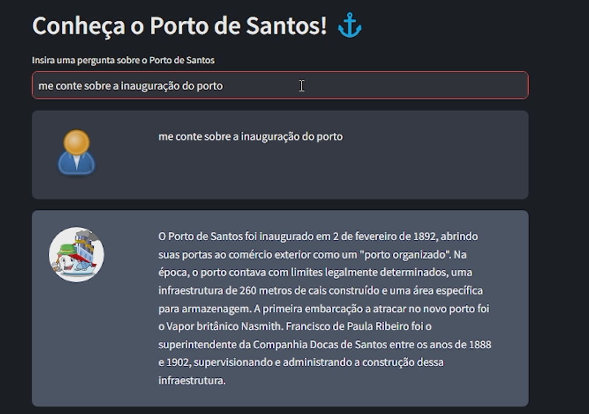

# Chat Bot utilizando em Python utilizando as tecnologias Langchain, Open AI e Streamlit

### Baixar as dependencias: 
langchain==0.0.184
PyPDF2==3.0.1
python-dotenv==1.0.0
streamlit==1.18.1
openai==0.27.6
faiss-cpu==1.7.4
altair==4
tiktoken==0.4.0

### Rodar o App:
streamlit run app.py

### Exemplo de OutPut:

